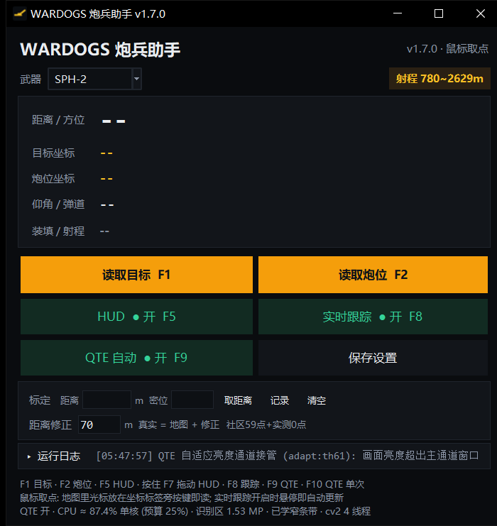
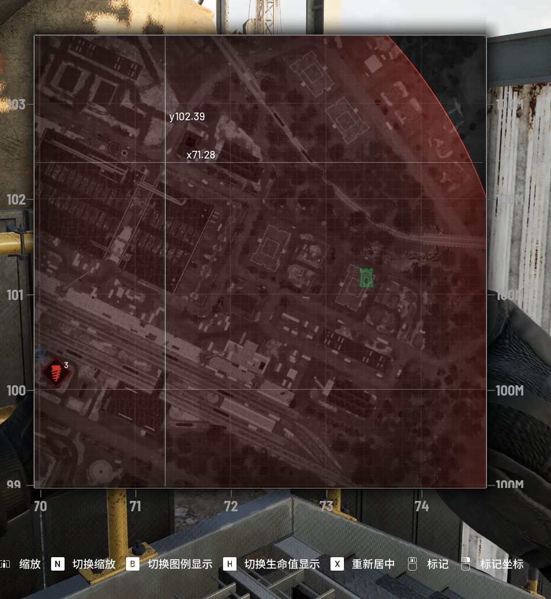
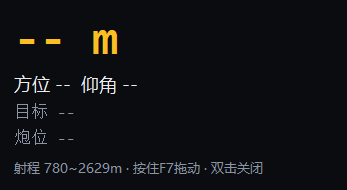
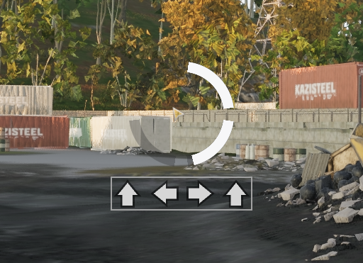
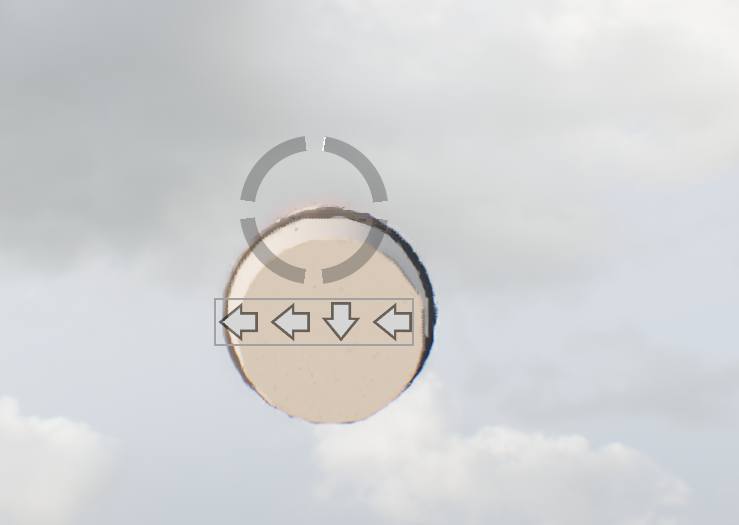

# WARDOGS 炮兵助手

《WARDOGS》(Steam) 的炮兵计算助手：鼠标点两下就读出**目标**和**炮位**坐标，自动算出
**距离 / 方位 / 仰角**，结果挂在游戏画面上方的悬浮小窗里边打边看；开炮前的方向键连按 (QTE)
也可以交给它自动完成。Windows 10 / 11，单文件 exe，打开就能用。

> 下载最新版：[GitHub Releases](https://github.com/ecokater/wardogs-artillery/releases)　|　[工具站](https://tools.duzehao.online/#tool-wardogs-artillery)（含往期版本）



## 它能做什么

| 功能 | 说明 |
| --- | --- |
| 鼠标取点 | 全屏战术地图上光标旁会出现白色坐标标签；`F1` 读目标、`F2` 读炮位，同一通道 |
| 射距解算 | 内置社区射表 + 游戏内实测标定，给出距离、方位、仰角 (mil)、弹道、装填时间、射程窗口判定 |
| 置顶 HUD | 半透明小窗实时显示距离与目标/炮位坐标，无边框游戏之上也可见，按住 `F7` 拖动位置 |
| QTE 自动输入 | 识别画面中央的方向箭行，从左到右自动按键；红色失败行自动忽略，不会向死行补键 |
| 分辨率自适应 | 换显示器、换系统缩放都不用重新设置 |

## 游戏内效果

**鼠标取点**：地图里把光标放在坐标标签旁按键即读（下图为自检样张，标签在光标右上方）。



**置顶 HUD**：一眼看到距离、方位、仰角和两点坐标。



**QTE 方向箭行**：暗底、亮天空都能认；按错的红色反馈行会被自动跳过。

| 暗底 | 亮天空 |
| --- | --- |
|  |  |

## 快速开始

1. 到工具站下载最新版 exe，双击打开（第一次启动会在 exe 同目录生成 `config.json`）。
2. 游戏切到**全屏**，把鼠标放到目标的坐标标签旁按 `F1`，再放到炮位标签旁按 `F2`。
3. 按 `F5` 打开悬浮窗看结果；需要自动按方向键时按 `F9`。

## 热键

| 键 | 作用 |
| --- | --- |
| `F1` | 读鼠标处目标坐标 |
| `F2` | 读鼠标处炮位坐标 |
| `F5` | 悬浮窗开关 |
| `F7` | 按住拖动悬浮窗 |
| `F8` | 实时跟踪开关 |
| `F9` | QTE 自动输入开关 |
| `F10` | 立即读一次 QTE |

## 从源码构建

```powershell
pip install opencv-python numpy mss keyboard
pyinstaller WARDOGS_Artillery.spec        # 产出 dist\WARDOGS_Artillery.exe (单文件, 无控制台)
```

## 设置与标定

- 所有设置保存在 exe 同目录的 `config.json`，可以直接用记事本改。
- 距离修正：社区射表给的是地图距离，实测要 **+70 m**（SPH-2）才是真实距离，已内置在
  `range_tables.json`；主界面 [标定] 行可以录入自己实测的 (距离, 密位) 样本进一步修正射表。

## 版本与开发记录

- 往期安装包（可下载旧版）：工具站详情页「往期版本」区块。
- 完整开发记录（每个版本的病根、修法、实测数据、回归测试）：[docs/DEVLOG.md](docs/DEVLOG.md)。

## 说明

个人学习项目，仅供自己离线使用；请遵守《WARDOGS》的用户协议。
